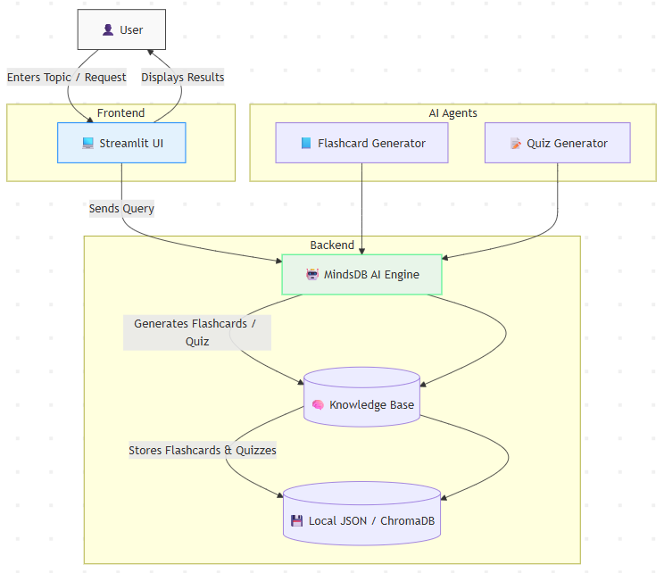

⚡MindSpark AI

MindSpark AI is an intelligent learning assistant that transforms how you study. It generates AI-powered flashcards and dynamic quizzes on any topic in seconds — helping learners, educators, and professionals retain knowledge smarter and faster.
Built with Streamlit and MindsDB, MindSpark AI merges simplicity with intelligence.

🎯 Use Case

Traditional studying methods are often time-consuming and static.
MindSpark AI automates the learning lifecycle:

Learners enter any topic (e.g., "Neural Networks" or "World War II").

The system instantly generates interactive flashcards and quizzes powered by AI.

Knowledge is stored, searchable, and reusable for consistent revision.

Admins (or educators) can manage topics and curate the learning experience.

Result: Personalized learning, better memory retention, and adaptive AI-driven insights.

✨ Features
🧠 Flashcard Generator

Instantly create topic-based flashcards with AI.

Flip animations for a modern, engaging experience.

Save and manage flashcards in your Knowledge Base.

🧩 Quiz Creator

Auto-generate multiple-choice questions (MCQs).

See instant correct answers and explanations.

Review quizzes for better understanding.

📊 Knowledge Base

Store and manage all topics in one place.

Delete, view, or explore previous AI-generated content.

Organize by subject or difficulty.

🎨 Modern Streamlit UI

Animated layout with smooth transitions.

Easy navigation between Home, Flashcards, and Quiz.

Responsive design for desktop and tablet users.

🤖 AI Engine

MindSpark AI uses MindsDB as its AI intelligence layer to:

Generate accurate, context-aware flashcards.

Produce structured quizzes with correct answers.

Learn from user inputs to refine topic quality over time.

🧱 Technology Stack
Python (Best Programming Language :P)
Streamlit (UI Library)
MindsDB (AI and KB Layer)
ChromaDB (Vector DB)
Nebius (For LLM and Embedding model)

🧠 Architecture

📚 Knowledge Base Schema

Name: flashcards_kb

content_columns = ["topic", "question", "answer"]
metadata_columns = ["type", "difficulty", "category"]
id_column = "id"

⚙️ Installation
Clone the GitHub repository
git clone https://github.com/yourusername/mindspark-ai.git
cd mindspark-ai

Setup virtual environment
python -m venv .venv
source .venv/bin/activate    # (Linux/Mac)
.venv\Scripts\activate       # (Windows)

Install dependencies
pip install -r requirements.txt

Run Streamlit App
streamlit run app.py